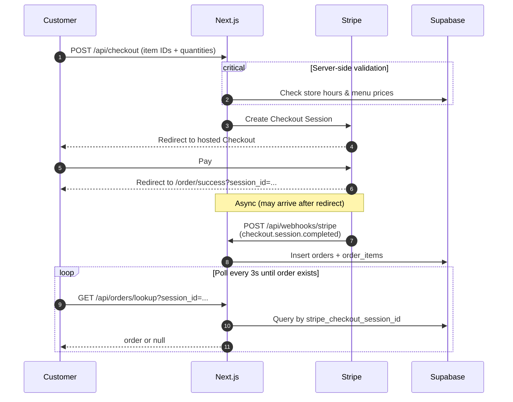

# Sapporo Sushi Pickup Order App
Mobile-first pickup ordering web application for a local sushi takeaway store to reduce wait times for customers during peak hours.

## Tech Stack
* **Frontend:** Next.js (App Router), React, TypeScript, Tailwind CSS
* **Backend:** Next.js API Routes (Route Handlers)ß
* **Database:** PostgreSQL (Supabase)
* **Payments:** Stripe Checkout & Webhooks
* **Infrastructure:** Vercel


## Sequence Diagram


## dijfie

```mermaid
flowchart TB
  subgraph Client
    C[Customer]
    K[Kitchen admin]
  end

  subgraph Vercel
    A[Next.js App Router<br/>UI + API routes]
  end

  subgraph External
    S[Stripe]
    DB[(Supabase)]
  end

  C -->|menu, checkout, order lookup| A
  C -->|pay| S
  A -->|create session| S
  S -->|webhook| A
  A -->|menu, orders, hours| DB
  K -->|admin UI| A
  K <-->|Realtime + poll| DB
  ```