# Sushi Sapporo - Pickup Order App
Mobile-first pickup ordering for a local sushi takeaway store to reduce wait times for customers during peak hours. Customers order and pay online; the kitchen gets a live queue with recovery paths when webhooks fail.

**Live:** https://www.sushisapporo.com.au/menu

## Tech Stack
- **Frontend:** Next.js (App Router), React, TypeScript, Tailwind CSS
- **Backend:** Next.js Route Handlers
- **Database / Auth / Realtime:** Supabase (PostgreSQL)
- **Payments:** Stripe Checkout + Webhooks
- **Hosting:** Vercel

## Features
- Menu → cart → Stripe Checkout (AUD), with server-side price/hours/sold-out checks
- Webhook fulfillment from a stored cart snapshot (`checkout_sessions`)
- Idempotent order creation + daily order numbers
- Kitchen dashboard (Realtime queue with polling as backup, completed orders, sold out)
- Paid-but-unfulfilled alerts with manual send-to-kitchen / dismiss

## Flow

```mermaid
sequenceDiagram
  autonumber
  participant C as Customer
  participant A as Next.js
  participant S as Stripe
  participant DB as Supabase

  C->>A: POST /api/checkout
  critical Server-side validation
    A->>DB: Check hours, prices, sold-out, modifiers
    A->>DB: Save checkout_sessions snapshot
  end
  A->>S: Create Checkout Session (metadata: checkout_id)
  S-->>C: Redirect to hosted Checkout
  C->>S: Pay

  S-->>C: Redirect to /order/success?session_id=...

  note over S,A: Async (may arrive after redirect)
  S->>A: POST /api/webhooks/stripe<br/>(checkout.session.completed)
  A->>DB: Load snapshot → insert orders + order_items

  loop Poll until order exists
    C->>A: GET /api/orders/lookup?session_id=...
    A->>DB: Query by stripe_checkout_session_id
    A-->>C: order or null
  end
```
